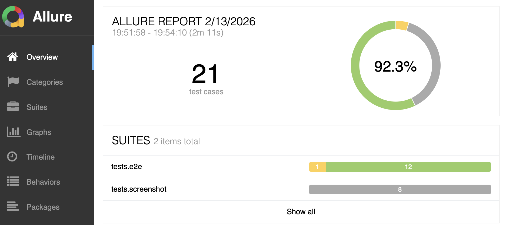
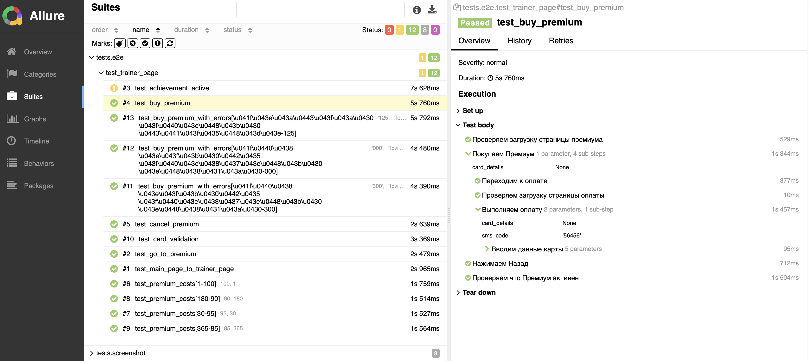
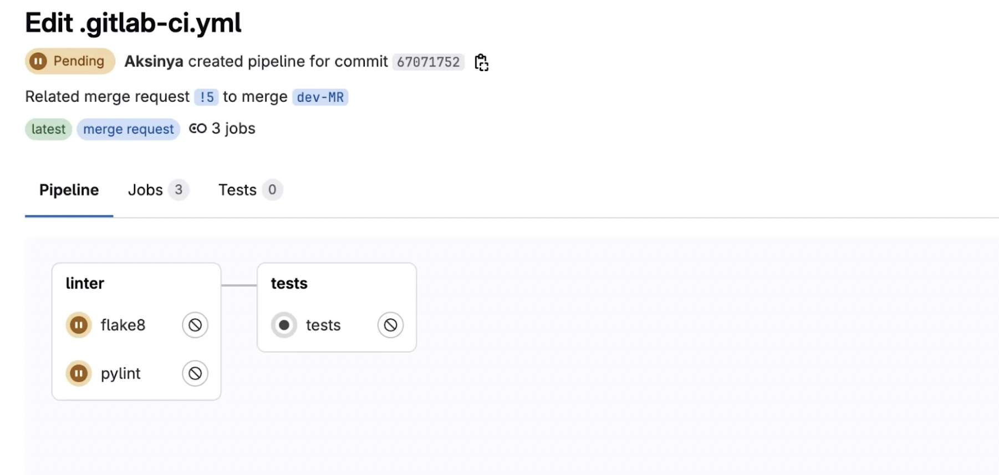

# Автотесты на веб-интерфейс проекта "Битва покемонов"

## Описание проекта и задачи
Автоматизировать часть проверок регресса с помощью Selenium.

### ⚙️ Используемый стек:
| Python | PyCharm | Git | Selenium | Allure Report | Gitlab CI |
|--------|---------|-----|----------|---------------|-----------|
|   |   || |  | 

### 📄 Тест-кейсы, которые автоматизировали (е2е-тесты)
* Переход с главной на страницу тренера (в авторизованном состоянии)
* Переход со страницы тренера на страницу покупки премиум-подписки
* Проверка активности достижения "Начало большого пути" у тренера
* Покупка премиум-подписки: успешный сценарий
* Отмена премиум-подписки
* Расчёт стоимости Премиума в зависимости от его продолжительности (больше дней — больше скидка)
* Валидация формы ввода карты для оплаты
* Покупка премиум-подписки: неуспешный сценарий

### 📄 Тест-кейсы, которые автоматизировали (скриншот-тесты)
* Карточка характеристик тренера
* Блок ввода количества дней при покупке премиум-подписки: до 30 дней, 30–180 дней, 180–365 дней, более 365 дней
* Форма оплаты: пустая форма, заполненная форма, неверный номер карты, неверный срок карты 

### ✅ Ожидаемый ответ:
Должны пройти все тесты, кроме:
* test_achievement_active

### 🗂️ Детали реализации
* Автотесты написаны с применением Selenium
* Используется подход POM

### 📋 Установка и настройка
1. Создать виртуальное окружение Python с версией не менее 3.12. Далее вся работа должна производиться в этом окружении.
2. Установить все зависимости из requirements.txt
3. Создать файл .env (можно скопировать [.env_template](.env_template), только задать там правильные значения переменных окружения).

### ▶️ Запуск автотестов
Запустить тесты: pytest -v

### 🟢 Интеграция с Allure

### 🟠 Интеграция с Gitlab CI

Для запуска в Gitlab CI значения переменных окружения вводятся в веб-интерфейсе.

Для отработки джобы linters необходимо сделать MR.

